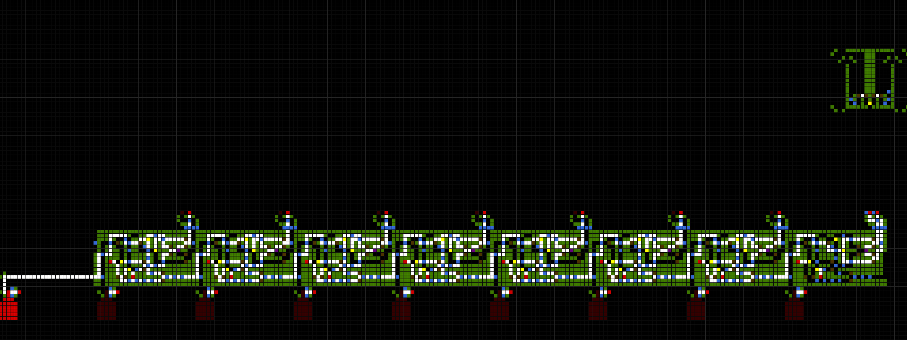
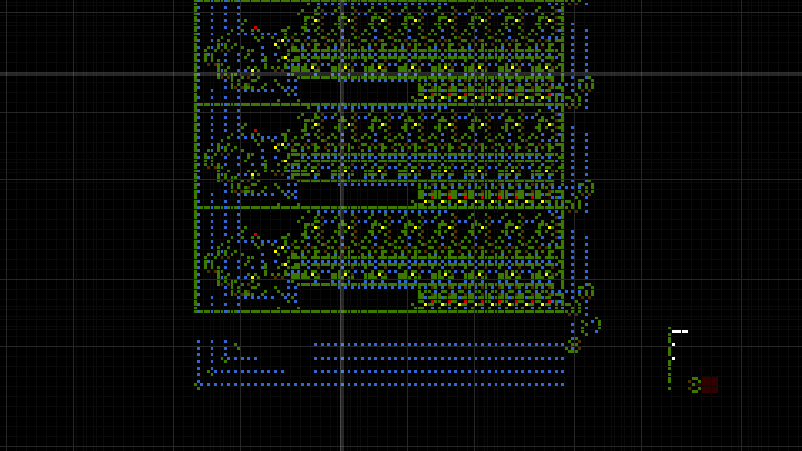
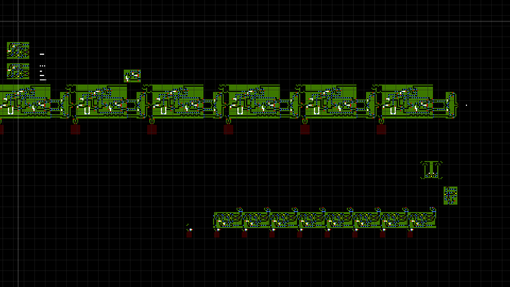

# Cellular Automaton GPU

__Project creation date:__ 16.03.2018

## Description
This project is for simulating digital circuits by using cellular automaton.\
The simulation is done on the GPU with shaders.

## Rules
There are 8 diffrent types of cells:
1. __White cell:__ The main cell which moves each simulation step one pixel in their direction.
2. __Green cell:__ Used to change the direction of white cells and define outputs for logic gates.
3. __Blue cell:__ Used to make white cells jump over them to create junctions.
4. __Yellow cell:__ AND gate
5. __Brown cell:__ OR gate
6. __Purple cell:__ XOR gate
7. __Light & dark red cell:__ Used to store data. ON state is light red and OFF is dark red.

## Technologies
* C#
* MonoGame

## Pictures

***

***

